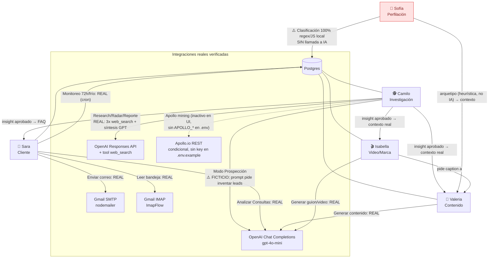

# Auditoría del módulo "Agentes IA" — cómo funcionan hoy y dónde fallan

Fecha: 2026-08-10 · Alcance: `src/crm/CRMDashboard.tsx`, `server/index.js`, `server/crisisDetector.js`, `server/prospectMonitor.js`, `server/emailPoller.js`, `server/legalAlertMonitor.js`, `.env.example`

## 1. Diagrama de interrelación real

**Lectura rápida:** de los 5 agentes, **4 hacen llamadas reales a OpenAI y/o servicios externos** (Camilo, Sara, Valeria, Isabella). **Sofía es 100% una función determinística en JavaScript** (reglas sobre ocupación/notas/presupuesto) — no llama a ningún modelo de IA ni servicio externo, aunque se presenta en la UI como "PhD · Psicología del Consumidor de Lujo" con perfilación por IA.

## 2. Tabla de hallazgos por agente

| Agente | Acción | ¿Integración real? | Qué hace en realidad | Referencia |
|---|---|---|---|---|
| Camilo | Research / Radar de Competencia / Reporte de Mercado | ✅ Sí | Llama a OpenAI Responses API con `tool: web_search` (búsqueda real en internet) 3 veces, luego sintetiza con `gpt-4o-mini` y reglas anti-alucinación | `server/index.js:1138-1320` |
| Camilo | Modo "Prospección" (minar nuevos leads) | ❌ **Ficticio por diseño** | El prompt le pide a OpenAI generar "2 prospectos ficticios pero realistas" (nombres, correos, teléfonos inventados) y se insertan como prospectos reales en el CRM | `CRMDashboard.tsx:3184-3268` |
| Camilo | Apollo.io (minería real de leads) | ⚠️ Condicional | Ruta real (`api.apollo.io`), pero requiere `apiKey` por tenant que hoy **no existe** en `.env.example`; el indicador "Apollo" en la UI está **hardcodeado en `false`**, no refleja configuración real | `server/index.js:1370-1399`; `CRMDashboard.tsx:11436-11439` |
| Sofía | Perfilación / arquetipos psicográficos | ❌ **Sin IA** | Función JS determinística (`classify()`), reglas regex sobre ocupación/notas/presupuesto/canal de contacto. Solo el resultado se persiste vía `PUT` real a la base de datos | `CRMDashboard.tsx:3387-3484` |
| Sara | "Analizar Consultas" | ✅ Sí | Lee prospectos reales de Postgres, llama a OpenAI por cada uno para generar borrador de respuesta | `CRMDashboard.tsx:3278-3384`; `server/index.js:1404-1466` |
| Sara | Enviar correo aprobado | ✅ Sí | `nodemailer` real vía Gmail SMTP | `server/index.js:69, 1513-1550` |
| Sara | Leer bandeja de entrada | ✅ Sí | `ImapFlow` real contra `imap.gmail.com`, genera borradores con GPT | `server/emailPoller.js:223-345` |
| Sara | Monitoreo automático (72h, prospectos fríos) | ✅ Sí | `setInterval` real sobre datos reales de Postgres | `server/prospectMonitor.js:128-488` |
| Valeria | Generación de contenido | ✅ Sí | `POST /api/ai` → OpenAI real, con contexto de proyecto/marca/prospecto inyectado | `CRMDashboard.tsx:3486-3748`; `server/index.js:1103-1122` |
| Valeria | Fallback si OpenAI falla | ❌ Plantilla fija | Texto genérico hardcodeado con placeholder de proyecto | `CRMDashboard.tsx:3726-3743` |
| Isabella | Guion de video / adaptación de contenido | ✅ Sí | Mismo patrón `/api/ai` real | `CRMDashboard.tsx:3751-3997` |
| Isabella | Fallback si OpenAI falla | ❌ Plantilla fija | Guion genérico hardcodeado | `CRMDashboard.tsx:4001-4008` |
| Detector de Crisis | Alertas automáticas de KPI | ✅ Sí | `setInterval` real, consultas Postgres, correo real al admin | `server/crisisDetector.js:13-259` |
| Monitor Legal | Alertas de vencimiento | ✅ Sí | Igual patrón, datos y correo reales | `server/legalAlertMonitor.js:98-158` |

## 3. Riesgos de "alucinación" — lo que la UI dice vs. lo que el código hace

1. **El log "Deep search [1/3]/[2/3]/[3/3]" de Camilo es teatro visual.** Son `setTimeout` fijos de 600ms en el frontend, sin relación real con el tiempo que tarda la búsqueda del backend. La búsqueda sí es real (ver tabla), pero el progreso mostrado es decorativo. (`CRMDashboard.tsx:3092-3098`)

2. **El modo "Prospección" de Camilo inventa leads a propósito.** Es el hallazgo de mayor riesgo: un agente presentado como "minero de datos" en realidad recibe instrucciones explícitas de fabricar nombres, correos y teléfonos falsos, indistinguibles en el CRM de un lead real una vez insertados. (`CRMDashboard.tsx:3191-3245`)

3. **Los indicadores "GPT-4o Search / SMTP / Apollo" del encabezado son literales fijos, no chequeos de salud reales.** Mostrarán "SMTP activo" aunque falten `SMTP_USER`/`SMTP_PASS` en `.env`, y "Apollo inactivo" aunque un tenant sí tenga su key configurada. Contrasta con el indicador de DocuSign, que sí consulta `/api/docusign/status` en vivo. (`CRMDashboard.tsx:11436-11439` vs `17992`)

4. **El propio código documenta un historial de alucinaciones ya parchado** — evidencia de que el equipo ya identificó este patrón de riesgo antes:
   - Comentario en `server/index.js:1130-1137`: antes el modelo "inventaba citas de aspecto creíble" cuando la búsqueda fallaba en silencio.
   - Reglas "ANTI_HALUCINACION" (`server/index.js:1172-1185`): agregadas tras detectar que el modelo inventaba nombres de instituciones como fuente y concatenaba cifras en números absurdos (ej. `"$675.676.216.216.810.000"`).
   - Estas son instrucciones a nivel de prompt, no validación determinística — no hay verificación server-side de que las "fuentes" citadas realmente aparecieron en los resultados de búsqueda antes de mostrarse al usuario.

5. **No se encontró scraping real de LinkedIn/redes sociales.** Toda la "investigación" de Camilo viene de `web_search` genérico de OpenAI, no de una integración dedicada a LinkedIn. Solo Apollo (inactivo hoy) devolvería un campo `linkedin_url` real.

## 4. ¿El "enjambre colaborativo" es un pipeline real o solo narrativa?

**Es un pipeline real de datos**, con dos matices importantes:
- Cuando se aprueba un insight de Camilo, sí se dispara `handleValeria`/`handleIsabella`/Sara-FAQ con el **contenido real** del insight inyectado en cada prompt — no es solo cosmético.
- Pero uno de los 5 nodos (Sofía) no es IA — así que la narrativa de "5 agentes de IA colaborando" incluye un eslabón que es una heurística de reglas, no un modelo.
- No hay orquestación server-side/cola de trabajos: el "swarm" son llamadas secuenciales `await` desde el navegador — si se cierra la pestaña a mitad de la ejecución, el pipeline se detiene.

## 5. `.env.example` — qué está realmente configurable

Todas las variables son placeholders vacíos por defecto (documentado explícitamente en el archivo). Las que habilitan las integraciones reales descritas arriba: `DATABASE_URL`, `OPENAI_API_KEY`, `SMTP_USER`/`SMTP_PASS`, variables de IMAP, `ADMIN_EMAIL`. **No existe ninguna variable `APOLLO_*`** — esa integración depende de una key guardada por tenant en base de datos, no de `.env`.

## 6. Recomendaciones (para decidir con Armando)

1. **Camilo — modo Prospección**: decidir si se elimina la generación de leads ficticios, o si se deja pero con un marcador visual explícito en el CRM (ej. badge "Lead sintético — validar manualmente") para que nunca se confunda con un prospecto real.
2. **Sofía**: decidir si se etiqueta honestamente como "motor de reglas" en vez de "IA/PhD", o si se migra su clasificación a una llamada real a OpenAI (mismo patrón que Valeria/Isabella) para que sea consistente con el resto del enjambre.
3. **Indicadores de estado del header** (`GPT-4o Search`/`SMTP`/`Apollo`): conectarlos a chequeos reales (ej. un `GET /api/health` que valide que las env vars estén presentes), igual que ya existe para DocuSign.
4. **Progreso de "Deep search"**: reemplazar los `setTimeout` fijos por eventos reales del backend (ej. streaming o polling de estado) para que el usuario vea progreso verídico, no decorativo.
5. **Apollo**: si se planea usar, agregar `APOLLO_*` a `.env.example` y documentar el flujo de configuración por tenant; si no, quitar el indicador de la UI para no sugerir una capacidad inexistente.
